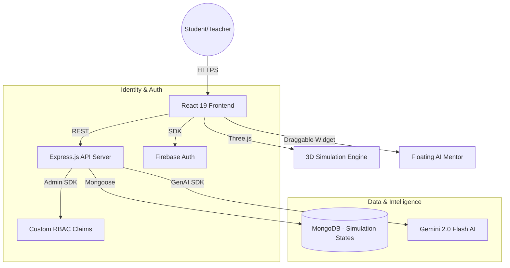

<h1 align="center">🔬 Vijnana Lab — Experience Science</h1>

<p align="center">
  
  
  
  
  
</p>

<p align="center">
  <b>Democratizing high-fidelity science laboratory education for Class 11 & 12 students across Bharat.</b>
</p>

---

## 🚩 Problem Statement
In the current educational landscape of Bharat, millions of students in rural or under-funded Pre-University colleges lack access to functional physics and chemistry laboratories. Equipment like Vernier Calipers, Spectrometers, or Titration setups are often broken, missing, or one-of-a-kind, leading to **"Rote Learning"**—where students memorize practicals without ever touching the apparatus.

## 💡 Proposed Solution
**Vijnana Lab** provides a high-fidelity, interactive, and safe virtual sandbox for scientific discovery. By leveraging **WebGL (React Three Fiber)** and **Physics Engines**, we bring the laboratory to the student's smartphone or PC.

- **Immersive 3D Manipulation**: Touch or mouse-driven interaction with high-precision instruments.
- **AI-Guided Discovery**: A Gemini 2.0-powered assistant that tracks experiment state and provides contextual hints.
- **Teacher-Led Governance**: A robust role-based dashboard for educators to track class-wide progress.
- **Zero Barrier to Entry**: Works in any browser without expensive hardware.

---

## 🏗 System Architecture



---

## 📂 Project Structure

```bash
vijnana-lab/
├── components/          # Reusable UI (GlassCards, Navbar, AIFloatingTutor)
├── pages/               # Functional Views (ApparatusLabs, Dashboards, About)
├── server/               # Express.js Backend (Secure AI Proxy, RBAC Admin)
│   ├── routes/          # API Endpoint Definitions
│   └── models/          # MongoDB Schema for Progress Tracking
├── services/            # Client-side Logic (Firebase, AI Fetching)
├── public/              # High-fidelity Assets & Textures (Hero Banner)
└── App.tsx              # Main Routing & Role Guards
```

---

## 💻 Tech Stack

| Layer | Technologies |
| :--- | :--- |
| **Core** | React 19, TypeScript, Vite |
| **Styling** | Tailwind CSS v4 (Glassmorphism), Framer Motion |
| **3D Rendering** | Three.js, React Three Fiber, Drei |
| **Intelligence** | Gemini 2.0 Flash AI (via Secure Backend Proxy) |
| **Identity** | Firebase Authentication + Custom Role Claims |
| **Database** | Cloud Firestore + MongoDB (Mongoose) |

---

## 🚀 Getting Started

### Prerequisites
- **Node.js** (v18.0 or higher)
- **Git**
- **Firebase Project** (with Service Account Key)

### Installation

1. **Clone the Project**
   ```bash
   git clone https://github.com/mahi-2-ron/vijnana_lab_ai.git
   cd vijnana-lab
   ```

2. **Install Dependencies**
   ```bash
   npm install
   ```

3. **Environment Setup**
   Create a `.env.local` file in the root:
   ```env
   GEMINI_API_KEY=your_google_ai_key
   MONGO_URI=your_mongodb_connection_string
   SERVER_PORT=5000
   ```
   *Note: Ensure `server/scripts/serviceAccountKey.json` is present for RBAC features.*

4. **Launch the Full-Stack Portal**
   ```bash
   npm run dev:full
   ```
   - **Frontend**: http://localhost:5173
   - **Backend Health**: http://localhost:5000/api/health

---


## 🛡 License & Team
Vijnana Lab is developed by **Team Supra** for the Hackolympic Innovation Challenge. All rights reserved. 


